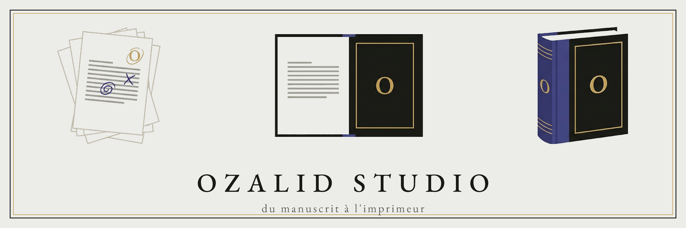

Ozalid Studio transforme un manuscrit en fichiers prêts pour l'imprimeur. Vous fournissez
un texte et une idée de couverture. L'application rend l'intérieur composé, la couverture,
et la planche complète à déposer chez un imprimeur à la demande.

**Le problème qu'elle règle est le dos.** L'épaisseur du dos dépend du nombre de pages, qui
dépend du texte, du format et de la police. Un chiffre recopié à la main se périme dès la
première correction, et le livre sort avec un titre décalé sur la tranche. Ici, le nombre
de pages ne passe jamais par un humain : l'intérieur le produit, la couverture le consomme.

Application de bureau pour **macOS et Windows**.

---

## Ce que l'application sait faire

- **Composer l'intérieur** d'un roman à partir d'un manuscrit Markdown, avec chapitres,
  page de titre, ruptures de scène et pagination.
- **Dessiner la couverture** : première, quatrième, dos et planche complète, réglés à
  l'écran avec un aperçu qui sort du même moteur que le PDF final.
- **Calculer le dos** automatiquement, d'après la pagination réelle et le papier choisi.
- **Gérer plusieurs livrables** pour un même livre : le même texte chez deux imprimeurs,
  ou en deux formats, chacun avec ses fichiers.
- **Générer les packages** : un répertoire par livrable, contenant l'intérieur, la planche
  et une vignette de contrôle.
- **Connaître six imprimeurs** — Lulu, BoD, Amazon KDP, CoolLibri, TheBookEdition,
  Bookvault — soit 61 formats, avec leurs marges, leurs papiers et leurs formules de dos.
- **Tirer une épreuve de relecture** : A4, numéros de ligne, marge d'annotation.
- **Produire des ebooks** : un PDF et un EPUB du livre entier.
- **Personnaliser des exemplaires** : un envoi autographe placé sur la page de votre choix,
  écrit à la main et photographié, ou composé par un modèle d'image.

---

## Installer

### Windows

L'installeur `.exe` se télécharge depuis les **releases** du dépôt. L'installation ne
demande aucun droit administrateur : elle se fait pour l'utilisateur courant, dans
`%LOCALAPPDATA%\Ozalid Studio`.

Au premier lancement, Windows affiche « Windows a protégé votre PC ». C'est SmartScreen,
qui ne reconnaît pas encore l'éditeur. Choisissez **Informations complémentaires**, puis
**Exécuter quand même**.

### macOS, depuis les sources

```
outils/typst.sh --local     # ou sans --local pour télécharger la version épinglée
outils/polices.sh           # environ 10 Mo de polices libres
cd src-tauri && cargo tauri dev
```

Le premier script installe le moteur de composition dans `src-tauri/binaries/`, le second
les polices dans `src-tauri/fonts/`. Ces deux répertoires ne sont pas versionnés.

La version du moteur est **épinglée**, et ce n'est pas un détail : deux versions ne
composent pas forcément le même nombre de pages, donc pas le même dos.

---

## Écrire le manuscrit

Le manuscrit est un fichier Markdown, mais l'application n'en accepte qu'un
**sous-ensemble volontairement étroit** :

| Ce que vous écrivez | Ce que ça donne |
|---|---|
| `# Titre du livre` | le titre |
| `## 01 - Le jardin` | un chapitre, numéroté et titré |
| `*mot*` et `**mot**` | italique et gras |
| `---` | une rupture de scène, marquée par trois astérisques |
| `___` | un blanc muet ; deux `___` à la suite creusent deux lignes |

**Tout le reste est refusé**, avec son numéro de ligne : listes, liens, images, tableaux,
citations. Ce refus est délibéré. Un élément silencieusement aplati donnerait un livre
imprimé faux, découvert après le tirage.

Deux points à connaître :

- **La ligne vide ne coupe rien.** Elle sépare les paragraphes, comme partout. Pour aérer
  une page, il faut écrire `___`.
- **Un saut de page inséré par un traitement de texte est refusé.** Il est invisible, il
  traverse la composition sans erreur, mais il empêche une liseuse d'ouvrir le chapitre.

---

## Du manuscrit à l'imprimeur

### Les repères de la fenêtre

La fenêtre tient en quatre bandes, de haut en bas :

1. **L'entête** nomme le livre ouvert, son chemin et son état d'enregistrement. C'est aussi
   là que s'affiche tout refus de saisie.
2. **Les onglets** — Livre, Couverture, Livraison, Envois — dans l'ordre où le livre se
   fait. Chacun porte un résumé de son état, et un témoin rouge quand il réclame quelque
   chose.
3. **L'étape** ouverte occupe le centre.
4. **Le pied** porte le livrable visé et la **légende** de la dernière composition : pages,
   chapitres, gouttière, dos, et un lien vers le PDF de l'intérieur.

Vous ne trouverez **aucun bouton « Composer »**, et c'est voulu. La composition est une
conséquence, pas une étape. L'application la tient à jour comme un tableur tient ses
formules : dès qu'un réglage périme la mesure, elle recompose seule.

Elle attend cependant votre accord une première fois. **Charger un manuscrit** est ce
geste. Ouvrir un projet existant ne l'est pas : on ouvre souvent pour regarder une
couverture, et faire tourner le moteur une minute pour rien coûterait plus que ça ne
rapporte.

### 1 · Livre

L'identité du livre et son texte.

- **Le manuscrit** se choisit ici. Il est **copié** dans le projet, ce qui rend celui-ci
  complet sur une autre machine. Si vous corrigez le fichier d'origine, le bouton
  « Réimporter le manuscrit » met la copie à jour.
- **L'identité** : titre, auteur, genre, éditeur, collection, monogramme, prix, mention,
  dédicace. Ces champs alimentent la couverture — une maquette dit *où* le titre paraît,
  jamais *quel* titre.
- **Le dépôt légal** se saisit ici même, dans cet onglet, mais n'alimente pas la
  couverture : il n'apparaît que dans le pavé de copyright de l'intérieur, et seulement
  si l'auteur le cite.
- **Le pavé de copyright**, composé en page liminaire de l'intérieur, est un texte libre.
  Il reconnaît les mêmes neuf jetons que le pied de la 4ème — voir 2 · Couverture.
  L'ISBN et le dépôt légal se saisissent dans cet onglet ; l'imprimeur vient du livrable,
  si bien que le même livre composé chez deux imprimeurs porte deux mentions sans qu'on
  ait rien retapé — sur la couverture comme dans l'intérieur, qui sortent de la même
  commande. Dans l'ebook, qui n'est imprimé nulle part, `%IMPRIMEUR%` ne rend rien.
- **La police de l'intérieur** se choisit parmi sept serifs de labeur : EB Garamond (par
  défaut), Crimson Pro, Alegreya, Cardo, Vollkorn, Spectral, Libre Baskerville. Un exemple
  montre l'écriture réelle, dans les octets que le moteur composera.
  **Changer de police change la pagination, donc le dos.**
- **La table des matières** est un réglage à trois états — absente, en tête, en fin —,
  **éteinte par défaut**. Elle reprend parties, chapitres et pièces sur deux rangs, avec
  l'intitulé que leur page d'ouverture imprime et le folio où elles s'ouvrent. En tête,
  elle vient avant la préface ; en fin, après les annexes. **L'allumer ajoute des pages,
  donc change le dos** — la composition repart d'elle-même, et le pied dit où elle en est.
  Le PDF ebook la porte aussi ; l'EPUB, lui, garde sa table de navigation native.
- **L'épreuve de relecture** se tire d'ici, en un bouton.

### 2 · Couverture

Quatre faces à régler : **1ère**, **4ème**, **Dos**, **Planche**.

- **Partez d'une maquette.** Trois sont livrées — Bandeau, Filets, Surimpression. Toute
  maquette se clone, y compris une maquette livrée : c'est ainsi qu'on se fait la sienne.
  Une maquette enregistrée emporte tout — modes, cadre, styles, dos, voile, cadrage,
  images — sauf l'identité du livre.
- **La 4ème** porte un texte de présentation et, au-dessus, l'auteur, le titre et un filet,
  chacun activable séparément. Le texte reconnaît des jetons comme `%TITRE%` ou `%AUTEUR%`,
  résolus à la composition — les mêmes jetons que reconnaît le pavé de copyright, en
  1 · Livre, `%IMPRIMEUR%` compris : le pied de la 4ème nomme l'imprimeur du livrable visé,
  comme la page de copyright le fait.
- **Le dos se règle élément par élément.** Auteur, titre, éditeur et collection y ont
  chacun leur style, leur place, leur rang et leur sens de lecture. Place et sens se
  règlent **à la souris**, directement sur l'aperçu. Seule la **largeur** du dos échappe à
  tout réglage : elle vient de la pagination.
- **La planche ne se règle pas, elle se vérifie.** C'est l'assemblage 4ème | dos | 1ère,
  fond perdu compris.

### 3 · Livraison

C'est ici, et nulle part ailleurs, qu'on déclare **ce qu'on fabrique**.

Un **livrable** tient en quatre choix : l'imprimeur, son format, sa reliure, son papier —
plus un pelliculage quand l'imprimeur en offre un. Chaque choix est limité à ce que cet
imprimeur propose réellement, et les cinq listes se lisent de gauche à droite : l'imprimeur
commande tout le reste.

Une reliure que l'application ne sait pas encore composer apparaît **grisée** : elle reste
visible, parce que l'imprimeur la propose, mais elle ne se choisit pas. Ce qui manque à
l'application pour la composer est dit plus bas, en « Limites connues » — l'écran ne le
répète pas sous chaque livrable.

Chez les imprimeurs qui ne publient ni formule de dos ni fond perdu, un champ vous demande
ce que vous avez **relevé sur leur gabarit**. Ces champs naissent vides, jamais préremplis :
un chiffre par défaut se lirait comme une mesure. Si vous générez sans l'avoir rempli,
l'application refuse en disant précisément quoi mesurer et à quelle pagination. Aucun des
six imprimeurs fournis n'en réclame : ces champs ne paraissent que pour un catalogue que
vous auriez déposé vous-même.

**Générer** pose le livrable et compose son package d'un seul geste. Chaque livrable reçoit
son répertoire :

```
intérieur PDF   ·   planche PDF   ·   vignette PNG   ·   fiche de téléversement
```

La vignette est là pour répondre à « est-ce que ça tient ? » — sur du vrai, avec le dos
mesuré. C'est le PDF qui part à l'impression.

#### Ce que chaque ligne dit d'elle-même

Les livrables se rangent **par imprimeur** : le groupe porte son nom, la ligne ne le répète
pas. Trois livrables chez le même imprimeur ne diffèrent alors que par ce qui les distingue
vraiment. L'ordre est celui du premier ajout, et il ne bouge pas sous la main.

Sous le nom du livrable, une ligne dit **où en est son package** :

- *jamais généré* — on ne lui a rien demandé ; il n'a rien perdu.
- *à jour* — les fichiers sur le disque correspondent au livre tel qu'il est maintenant.
- *le texte et la couverture ont changé depuis cette génération* — en rouge, et il nomme
  **ce qui** a bougé. La nuance compte : recomposer un intérieur prend des secondes,
  recomposer une planche est immédiat.
- *la dernière génération a échoué : …* — avec sa raison. La relancer pour l'apprendre
  serait refaire ce qui a échoué.

Ce que seule une composition peut voir — un dos trop mince pour son texte, une police
remplacée, une image trop pauvre — s'affiche sur la ligne au moment où elle compose. À la
réouverture du projet, la ligne retrouve ses chiffres, ses chemins et sa vignette, mais pas
ces alertes-là : le `.ozalid` ne les retient pas, et les réinventer serait pire que de se
taire.

#### Les quatre gestes d'une ligne

- **Modifier** reprend le livrable dans le formulaire, relevés compris, et le bouton devient
  *Remplacer*. Le package est recomposé avant que l'ancien ne soit effacé : une composition
  qui échoue laisse le package d'avant intact.
- **Dupliquer** remplit le formulaire avec les mêmes axes, sans rien remplacer. C'est le
  geste qui sert à comparer deux papiers d'un même livre.
- **Régénérer** recompose sans toucher aux axes. Il peut légitimement **copier** l'intérieur
  d'un livrable du même gabarit déjà à jour au lieu de le recomposer : deux papiers d'un
  même format partagent leur intérieur, et c'est ce qui rend la comparaison gratuite.
- **Supprimer** efface les fichiers que l'application a écrits, retire le répertoire s'il
  ne reste rien, puis retire le livrable. Un fichier que vous y auriez déposé **survit**, et
  la ligne d'état le nomme. Le premier clic arme, le second supprime — le geste emporte le
  package avec la ligne. Le dernier livrable ne se supprime pas : c'est lui qui donne le
  format sous lequel on regarde la couverture.

**Tout regénérer**, en tête de liste, recompose tous les livrables. À la différence de
« Régénérer », il ne copie jamais : c'est le geste de rattrapage quand on ne sait plus ce
qui est à jour.

**Les ebooks se génèrent depuis la même étape.** Le livre entier pour un écran : la
couverture, les liminaires et tous les chapitres, en PDF et en EPUB. Le PDF est le livre
sans son imposition — marges symétriques, aucune page blanche de parité. Le format vient
du livrable visé.

### 4 · Envois

Facultatif : personnaliser des exemplaires, un par destinataire.

L'étape se lit de gauche à droite comme la question se pose. *Qui* : la liste des
dédicataires. *Quelle page* : un rail de toutes les pages, où l'on clique la vignette
voulue. *À quoi ça ressemble* : un canevas où l'on glisse, redimensionne et incline l'envoi
à la souris. *Avec quels réglages* : le mot ou l'image de cet exemplaire-là.

Deux garanties :

- **Ce que le canevas montre vient du moteur de composition** : ce que vous déplacez est ce
  qui s'imprimera, mêmes polices, mêmes coupures de lignes.
- **Un envoi ne crée aucune page.** Tous les exemplaires ont la même pagination, donc le
  même dos et la même planche.

Un envoi peut être une photo de votre écriture — deux curseurs détourent l'encre du papier
— ou une image demandée à un modèle. L'accès au modèle se règle dans les préférences de la
machine, jamais dans le fichier du livre.

### 5 · Chez l'imprimeur

L'application s'arrête au fichier. Ce qui reste — créer le compte, choisir les mêmes
réglages sur le site, téléverser, contrôler l'aperçu — est décrit imprimeur par imprimeur
dans **[le cookbook](docs/COOKBOOK.md)** : les réglages exacts à saisir, les valeurs de
chaque gabarit avec leur source, et les pièges de chacun.

Une règle vaut partout : **le papier commandé doit être celui déclaré**, puisque c'est lui
qui porte l'épaisseur du dos.

---

## Les fichiers

### Le projet : `.ozalid`

Un livre tient dans un seul fichier, qui est une archive :

```
projet.toml     identité du livre, police, réglages de couverture, livrables, envois
manuscrit.md    votre texte, copié
images/         les photos de la 1ère et de la 4ème
polices/        votre écriture manuscrite, si vous en fournissez une
envois/         les images des envois, une par dédicataire
```

Tout y est embarqué. Un `.ozalid` s'ouvre sur une autre machine et s'y recompose à
l'identique, même si les polices qu'il utilise n'y sont installées nulle part.

Il se comporte comme un document : on le crée, on l'enregistre, on l'enregistre sous, on
le ferme. Toute action qui perdrait du travail pose d'abord la question.

| Geste | macOS | Windows |
|---|---|---|
| Nouveau projet | ⌘N | Ctrl+N |
| Ouvrir | ⌘O | Ctrl+O |
| Enregistrer | ⌘S | Ctrl+S |
| Enregistrer sous | ⇧⌘S | Ctrl+Maj+S |
| Aller à l'étape 1 à 4 | ⌘1 … ⌘4 | Ctrl+1 … Ctrl+4 |

### La maquette : `.maquette`

Une couverture réutilisable, elle aussi archivée avec ses images. Les maquettes que vous
créez vivent dans le répertoire de configuration de l'application, pas dans le livre : un
`.ozalid` reste autonome, puisqu'il porte déjà sa couverture.

### Les sorties

Elles ne sont **pas** dans l'archive. Elles se posent à côté :

```
<nom-du-projet>/
    <livrable>/     intérieur, planche, vignette, fiche — un répertoire par livrable
    ebook/          le PDF et l'EPUB du livre entier
    epreuve.pdf     l'épreuve de relecture
```

Un projet jamais enregistré ne peut donc rien composer, faute d'endroit où écrire.

---

## Bon à savoir

- **L'aperçu par face montre la couverture rognée ; la planche montre le fond perdu.** Un
  élément calé au bord touche le bord dans l'onglet 1ère, et s'en trouve à quelques
  millimètres sur la planche. Cette bande-là est celle que le massicot emporte.
- **Une pastille réglée à 0 % déborde volontairement sous la coupe.** Le bord du livre fini
  est une ligne de coupe, pas une limite : le massicot travaille à un ou deux millimètres
  près.
- **La planche ne porte aucun trait de coupe ni repère de pli.** Plusieurs imprimeurs les
  refusent explicitement, et le fond perdu suffit à dire où couper.
- **La collection est éteinte par défaut sur le dos.** Allumée d'office, elle ajouterait un
  texte au dos de tous les livres qui en portent une.
- **Une police hors liste est refusée** plutôt que remplacée. Le moteur, lui, composerait
  dans sa police par défaut sans lever la moindre erreur, et le livre sortirait faux en
  silence. Si une police manque malgré tout, un `⚠ repli` s'affiche au pied.
- **Chaque répertoire livré porte sa fiche de téléversement.** `televersement.txt` dit
  l'imprimeur, le format, la reliure, le papier, la finition, puis ce que la composition a
  mesuré — pages, dos, gouttière, fond perdu, planche —, et enfin les avertissements du
  compte rendu. C'est ce qu'on recopie dans le formulaire de l'imprimeur, des semaines plus
  tard : les PDF, eux, sont muets. Rien n'y vient du cookbook, tout du catalogue.
- **Le compte rendu d'un package avertit sans refuser.** Une image posée sous 300 ppp
  s'imprimera floue ; un texte au dos sous le seuil que l'imprimeur publie — 81 pages chez
  Lulu, 79 chez KDP, rien chez les quatre autres — n'y est pas autorisé. Les deux
  s'affichent en gris à côté des chemins : le fichier reste juste, c'est le tirage qui
  déçoit, et c'est un jugement d'auteur. Le rouge, lui, reste à ce qui rend le PDF faux.
- **Georgia et Helvetica ne sont pas disponibles.** Elles appartiennent au système, ne sont
  pas redistribuables, et Helvetica n'existe pas sous Windows.
- **Le nombre de pages est pair chez les six imprimeurs du catalogue.** L'application ajoute au
  besoin une page blanche de fin, sans folio, et le compte qu'elle affiche l'inclut.
- **Le prolongement panoramique d'une image a besoin de la pagination**, puisqu'il cadre sur
  la planche entière — deux couvertures et le dos. Sans compte de pages, il est refusé
  plutôt qu'approché.

---

## Sous le capot

### Pile technique

- **Tauri 2 + Rust** pour l'application, interface en HTML/CSS/JavaScript sans bundler ni
  framework.
- **Typst** en sidecar : un binaire autonome, la même version sur les deux plateformes.
  C'est ce qui rend la pagination reproductible d'une machine à l'autre.
- **`ureq`**, seule dépendance réseau, utilisée uniquement pour demander une image à un
  modèle. Composer n'ouvre jamais de connexion.

L'interface ne porte aucune logique métier : elle appelle des commandes et affiche des
résultats. Tout le reste se teste sans fenêtre.

### Modules

| Module | Rôle |
|---|---|
| `catalogue` | Les imprimeurs, un fichier TOML chacun : formats, reliures, finitions, papiers, formule de dos, fond perdu |
| `manuscrit` | Markdown → chapitres → source Typst, avec refus explicite du non composable |
| `projet` | Le `.ozalid` : lecture, écriture, identité du livre |
| `gabarit` | Les jetons `%CLE%` des champs libres, substitués à la composition |
| `import` | Un `livre.toml` et une image → un projet et sa maquette |
| `image` / `png` | Dimensions et cadrage ; lecture des réglages inscrits dans un PNG |
| `couverture` | Maquette typée → source Typst des deux faces |
| `maquettes` | Le format `.maquette`, les livrées, les personnalisées |
| `interieur` | Source Typst de l'intérieur, police et tailles, convergence gouttière/parité |
| `typst` | Invocation du sidecar : mesurer, compiler, rendre un aperçu |
| `planche` | Assemblage 4ème \| dos \| 1ère, et dos composé élément par élément |
| `package` | Un livrable, un intérieur, une planche, dans son répertoire |
| `envoi` / `detourage` | L'envoi autographe, sa place sur la page, et la séparation encre/papier |
| `diffusion` | Demander une image à un modèle |
| `epreuve` | Source Typst de l'épreuve de relecture |
| `epub` / `ebook` | L'archive EPUB 3, et le couple PDF + EPUB à côté du projet |
| `police` | Ce qu'un fichier de police déclare, et ce qu'il porte vraiment |
| `preferences` | Projets récents, et ce qui appartient à la machine |
| `menu` / `commands` | Le menu natif et la frontière avec l'interface |

### Le catalogue

Un fichier TOML par imprimeur. Les six livrés sont dans `src-tauri/pods/`, incorporés au
binaire : aucun chemin à résoudre, aucun écart entre développement et livraison.

Le poste peut en déposer d'autres dans `<config>/pods/`. Un fichier y **remplace** le livré
de même clé, ou ajoute un imprimeur inconnu du binaire. Aucune recompilation n'est
nécessaire. Un fichier refusé — TOML illisible, valeur impossible, clé en double —
n'empêche pas le démarrage : il est écarté, et l'écran dit lequel et pourquoi.

Comment en écrire un : voir « Ajouter un imprimeur » dans [le cookbook](docs/COOKBOOK.md).

### Vérifications

```
cd src-tauri && cargo test && cargo clippy --all-targets -- -D warnings && cargo fmt --check
node --test tests/*.test.js
```

Le **témoin** est le garde-fou de la pagination. Il compose *Candide* (Voltaire, domaine
public) sur deux fabrications et vérifie le compte de pages obtenu :

```
cd src-tauri && cargo run --example temoin
```

Un écart signifie que la composition a bougé. À rejouer après toute modification touchant
l'intérieur.

Les autres exemples traversent la chaîne sans interface, et se **regardent** — c'est la
vérification qu'aucun test automatique ne peut faire :

| Exemple | Ce qu'il produit |
|---|---|
| `packager` | La chaîne entière : intérieur, pagination, dos, planche |
| `maquette` | Les maquettes en PNG — position du cadre, assiette du bloc titre, voile |
| `epreuve` | L'épreuve de relecture |
| `ebook` | Le PDF et l'EPUB, à juger dans une liseuse |
| `canevas` | Les trois rendus de l'étape Envois, et leur coût |
| `composer` / `importer` | Une composition seule, un import seul |

Les tests de l'interface exécutent le vrai `src/app.js` dans un faux DOM. Ils couvrent le
câblage, jamais le rendu : tout ce qui se voit se vérifie dans l'application.

### L'icône

`src-tauri/icons/source-1024.png` est la source, en 1024 px. Les dix-sept autres fichiers
du répertoire en dérivent :

```
cd src-tauri && cargo tauri icon icons/source-1024.png
```

La commande écrit aussi `icons/android/` et `icons/ios/`, que le `.gitignore` écarte : ce
projet ne cible ni l'un ni l'autre. Elle ramène par ailleurs `icon.png` à 512 px — c'est
son comportement, et c'est pourquoi la source est gardée à côté.

**L'arrondi et l'ombre vivent dans la source**, parce que rien ne les applique à leur
place : macOS n'arrondit pas les icônes et n'en ombre aucune, chaque application dessine
la sienne. La source suit donc le gabarit d'Apple — une forme de 824 px centrée dans un
canevas de 1024, soit 100 px de marge sur chaque bord, aux coins continus, posée sur une
ombre douce décalée vers le bas. Cette marge de 100 px n'est pas du vide : c'est ce qui
laisse l'ombre tenir dans le cadre. Hors de la forme, le PNG est transparent — sous
Windows, l'icône garde donc ses coins arrondis, ce qui est le comportement habituel d'une
application multiplateforme.

Le contrôle qui compte sur une icône est sa **réduction** : à 32 px, tout doit encore se
distinguer, et à 16 px la silhouette seule doit suffire.

### Limites connues

- **L'application ne compose que le dos carré collé.** Les autres reliures des catalogues
  — couverture rigide chez BoD, Lulu et TheBookEdition, dos carré rembordé chez CoolLibri —
  paraissent grisées à la Livraison : la planche leur demande un rempli, des mors et des
  cartons dont la géométrie n'est pas relevée. L'intérieur, lui, se compose pour elles.
  C'est une limite de l'application, pas du catalogue : le jour où ces géométries seront
  relevées, le grisé tombera sans qu'aucun fichier d'imprimeur ne change.
- Sous macOS, le « Quitter » du menu contextuel du Dock et l'extinction de session ne
  passent pas par la garde qui protège le travail non enregistré. Les couvrir demande une
  API que Tauri n'expose pas.
- L'installeur Windows n'est pas signé : SmartScreen avertit au premier lancement.
